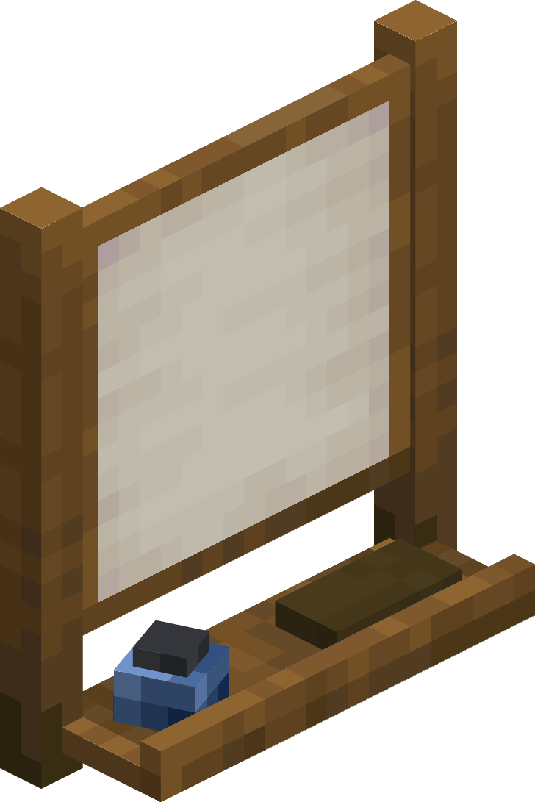
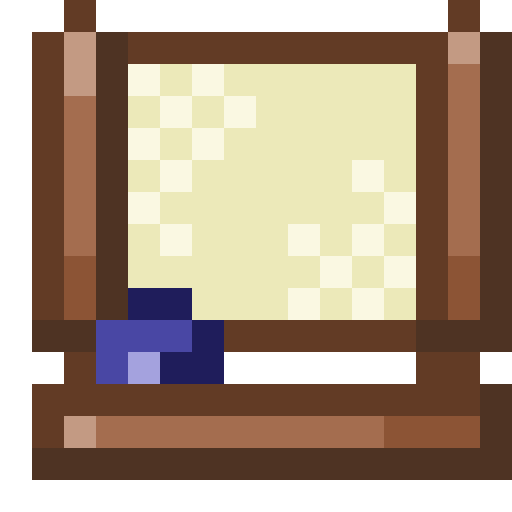
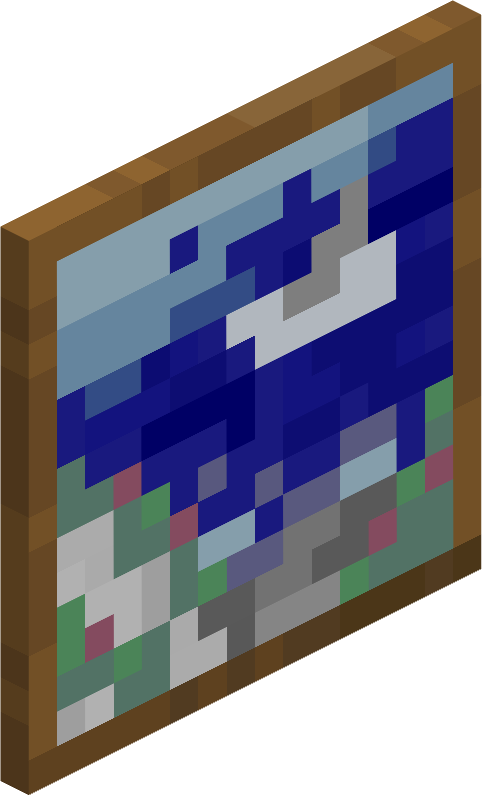
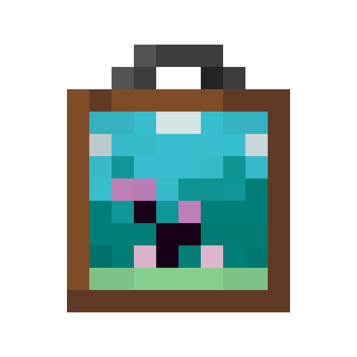
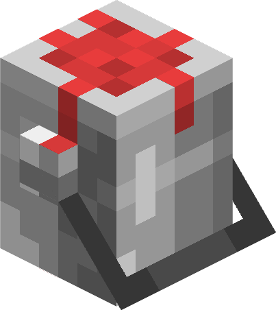
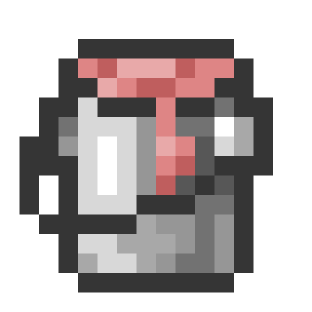
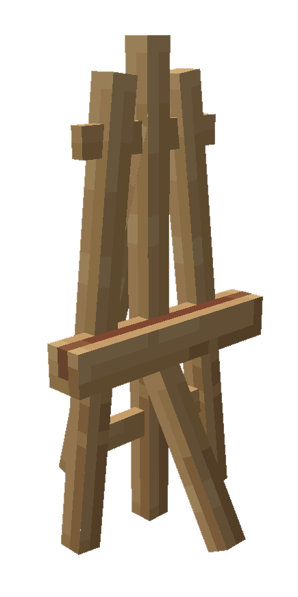
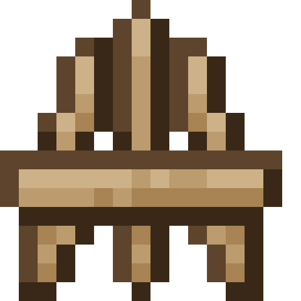
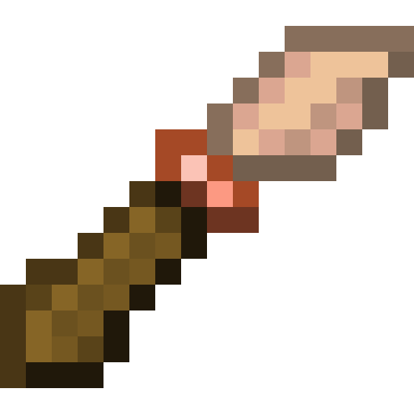

На нашем сервере можно рисовать свои картины с помощью кисти прямо на холсте без модов. В этом гайде все объясним: как рисовать, как ставить холст и многое другое

# 🎨 Блоки и предметы
| Блок                                                     | Предмет                                                       | Описание |
| :------------------------------------------------------- | :------------------------------------------------------------ | :------- |
|  |  | **Студия** Позволяет создавать кастомные картины. Можно создать, бросив яйцо на ванильную картину. |
|  |  | **Кастомная картина** Можно разместить где угодно, в том числе на полах и потолках. Ее можно получить, нажав кнопку "Экспорт" в студии, для чего требуется 1 ванильная картина. |
|  |  | **Ведро для красок** Позволяет сохранить дополнительные цвета в вашей палитре и может быть использовано как декорация. |
|  |  | **Мольберт** Позволяет стильно отображать картины и перемещать их. |
| — |  | **Кисть** Получается при щелчке правой кнопкой мыши на студии. Позволяет взаимодействовать с меню. |

***

# 📋 Студия
Позволяет создавать кастомные картины. Можно создать, бросив яйцо на ванильную картину. Вы можете открыть меню студии, щелкнув правой кнопкой мыши пустой рукой. В результате вы получите кисть, которая позволяет взаимодействовать с меню. Открывшееся меню показано ниже.

Прямо над холстом, на котором вы можете рисовать, находится меню "файл". Оно показывает название и размер вашего файла и содержит следующие кнопки:

- **Сохранить:** Это позволяет сохранить ваш файл. Если вы еще не назвали свой файл, вместо него откроется меню "Сохранить как".
- **Сохранить как:** Откроется меню, в котором вы сможете выбрать название для вашего файла. Вы можете задать название, написав его на первой странице книги и пера и нажав кистью на кнопку "Задать название из книги и пера". Имена файлов могут содержать от 1 до 24 символов и не должны содержать кавычек, обратной косой черты или перевода строки.
- **Загрузить:** Откроется меню, в котором вы сможете просмотреть все ваши файлы. Вы можете загрузить их в студию, чтобы отредактировать еще раз, а также удалить ненужные старые файлы из этого меню. В этом меню вы также можете закодировать свои рисунки в виде кода base64, чтобы поделиться ими с другими пользователями.
- **Новый файл:** Откроется меню, в котором вы сможете создать новый файл. Стрелки позволяют вам выбрать размер рисунка.
- **Экспорт:** При этом вы получаете кастомный рисунок, который ссылается на открытый в данный момент файл. Убедитесь, что ваш файл сохранен, иначе пользовательский рисунок по-прежнему будет отображать старые данные. Если вы находитесь в режиме выживания, при экспорте потребуется 1 ванильная картина.
- **Импорт кода:** Позволяет импортировать изображение в кодировке base64 в сохраненные рисунки. Для получения дополнительной информации см. раздел "Общий доступ к рисункам".
- **Отменить:** Отменяет последнее действие.
- **Повторить:** Повторяет последнее отмененное действие.

## Средство выбора цвета
Слева от холста находится средство выбора цвета. Вы можете сохранить два разных цвета одновременно. Вы также можете выбрать прозрачный цвет, который выполняет функцию ластика.

## Инструменты
Справа от холста находится меню "Инструменты". Здесь вы можете выбрать инструмент, который будет применяться при нажатии на холст. Доступные инструменты:
- **Кисть:** Помещает пиксели на холст. Вы можете выбрать размер кисти в правой части меню "Инструменты".
- **Пипетка:** Выбрать цвет выделенного пикселя.

***

# 🖼️ Мольберт

Мольберт - это объект, который позволяет отображать пользовательские картины. Просто щелкните правой кнопкой мыши на мольберте с пользовательской картиной, чтобы добавить ее на мольберт, и щелкните левой кнопкой мыши, чтобы удалить ее. Некоторые пользовательские модификаторы рисования также будут работать для картин на мольберте, если вы применили их к картине перед установкой ее на мольберт. Вы не можете изменять картины, пока они находятся на мольберте.

Вы можете выровнять картины на мольберте по вертикали, щелкнув правой кнопкой мыши пустой рукой. Щелчок без скрытия перемещает полосу вверх на 1 пиксель, щелчок с одновременным скрытием перемещает ее вниз.

## Крафт

***

# 🪣 Ведро с краской

Ведро с краской - это блок, который позволяет сохранять дополнительные цвета в палитре. Когда вы используете студию, вы можете щелкнуть правой кнопкой мыши удерживая ведро с краской, чтобы установить цвет в палитре в качестве активного для студии. Если вы щелкнете Shift + ПКМ , активный цвет из студии будет сохранен в палитре красок.

## Крафт

